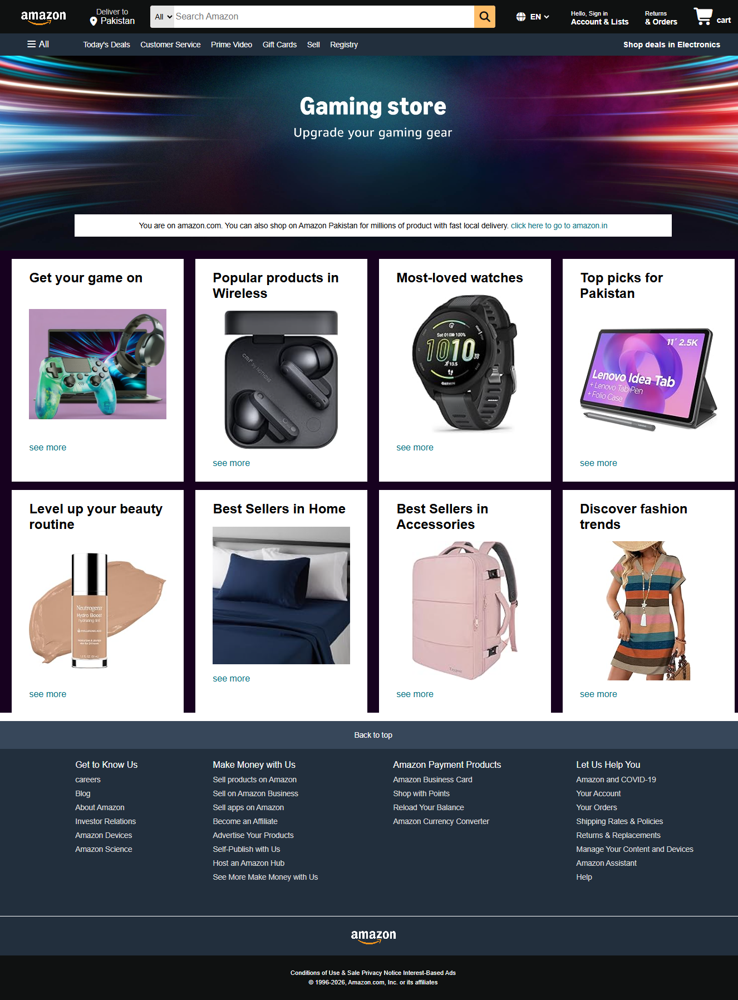

# Amazon Clone Website

A responsive Amazon clone website built using HTML and CSS.

# Live Demo

View Live Website: ( https://builds-by-noor.github.io/amazon-clone-website/)

# Preview

# Technologies Used

- HTML5
- CSS3

# About The Project

This project is a frontend clone of the Amazon website created to practice HTML and CSS concepts, including navigation bars, layouts, product sections, images, and responsive design.

# What I Learned

- Structuring webpages with HTML
- Styling webpages using CSS
- Creating navigation bars and layouts
- Working with images and assets
- Creating product sections
- Using Git and GitHub
- Deploying a website using GitHub Pages
